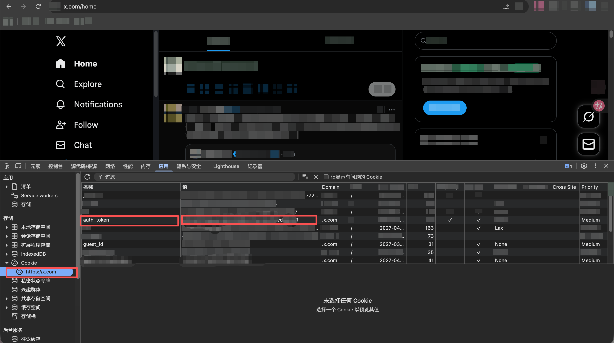
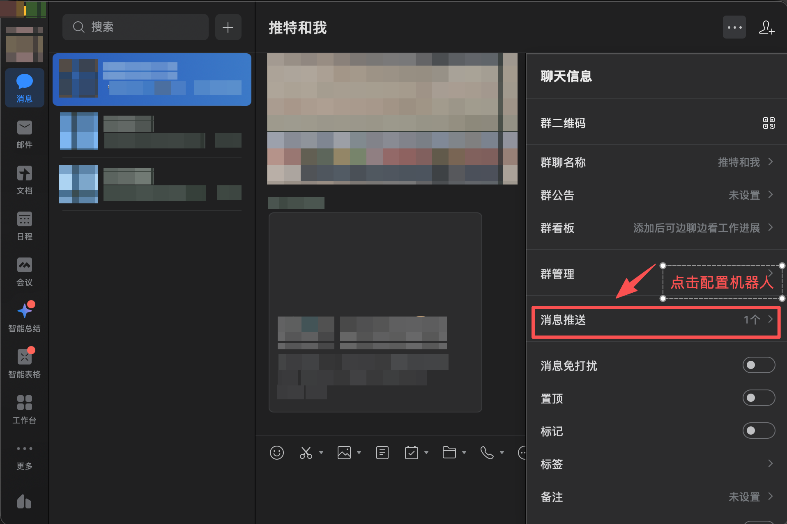

# X AI Radar

只监控 AI 圈 X 账号，并把新帖推送到企业微信/飞书（支持中文翻译、图片、视频链接）。

## What This Project Does

- 数据链路：`X -> RSSHub -> TrendRadar -> WeCom/Feishu`
- 监控范围：默认仅 AI 圈账号（当前 42 个）
- 推送策略：
  - 全天增量提醒（有新帖就推）
  - 每天 08:00 固定提醒（当前汇总）
- 内容增强：
  - 图片直接推送
  - 视频以卡片/链接推送（企业微信机器人接口限制）
- 可选中文翻译（默认关闭；开启后需 `AI_API_KEY`）

## Quick Start

### 1) Prepare `.env`

```bash
cp .env.example .env
```

必填项：

- `TWITTER_AUTH_TOKEN`
- `WEWORK_WEBHOOK_URL` 或 `FEISHU_WEBHOOK_URL`
- `AI_API_KEY`（可选，只有开启翻译/AI分析时才需要）

### 2) Validate

```bash
./scripts/doctor.sh
```

### 3) Start

```bash
./scripts/up.sh
```

### 4) Check Logs

```bash
docker logs -f x-trendradar
```

## Key Setup (for your screenshots)

### X `auth_token`

1. 登录 `x.com`
2. 开发者工具 -> Application -> Cookies -> `https://x.com`
3. 找到 `auth_token`，复制值
4. 写入 `.env`：



```env
TWITTER_AUTH_TOKEN=your_auth_token
```

### WeCom webhook

1. 企业微信群 -> 聊天信息
2. 点击 `消息推送`
3. 配置机器人并复制 webhook
4. 写入 `.env`：



```env
WEWORK_WEBHOOK_URL=https://qyapi.weixin.qq.com/cgi-bin/webhook/send?key=xxxx
```

## AI-Only Feed Source

AI 账号清单来源于：

- `提示词/X-关注博主与推送说明-最新.md`

已自动写入：

- `config/config.yaml` 的 `rss.feeds`（42 条，无重复）

## File Structure

```text
.
├── config/
│   ├── config.yaml
│   ├── timeline.yaml
│   └── feed_groups.json
├── overrides/
├── scripts/
│   ├── doctor.sh
│   ├── up.sh
│   ├── build_group_configs.py
│   └── up-groups.sh
└── docker-compose.yml
```

## Common Commands

```bash
# Start
./scripts/up.sh

# Stop
docker-compose down

# Container status
docker-compose ps
```

## Security

- 不要提交 `.env`、数据库、日志文件
- 不要在截图或 issue 里暴露 webhook/token
- 若密钥曾暴露，请立即重置
